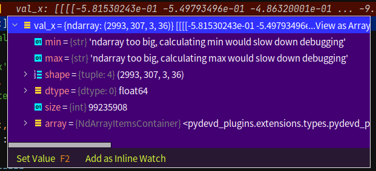
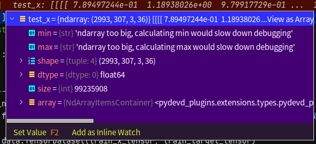
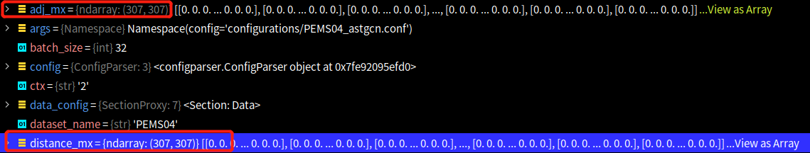
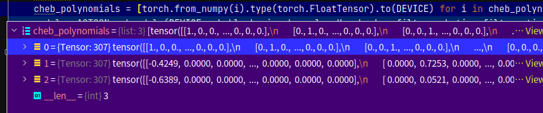

This is a doc that explains the model of [ASTGCN](https://github.com/guoshnBJTU/ASTGCN-r-pytorch).  
Data has been processed and you can find the detail of the porecessed data in [Prepare_Data](https://github.com/tami1082/Traffic-Public-Datasets/blob/main/Prepare_Data.md).

* Prepare: Data, chevb coefficients, model.

See the detail data in the pics, from left to right, x-train/x-val/x-test/  

    
    
    

After that, adj_matrix is loaded. 

    

The coefficients of chevb.

    

The whole model.  

    

