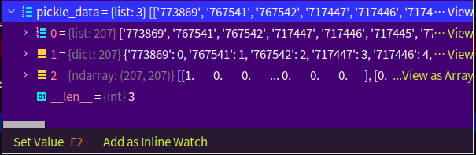
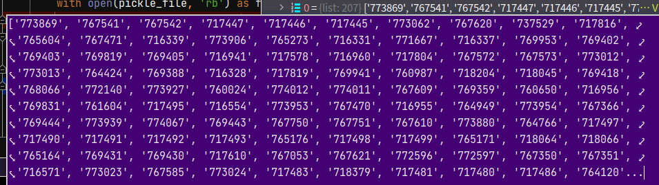
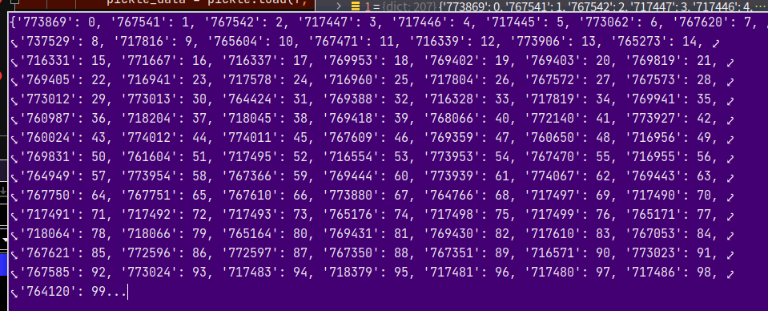
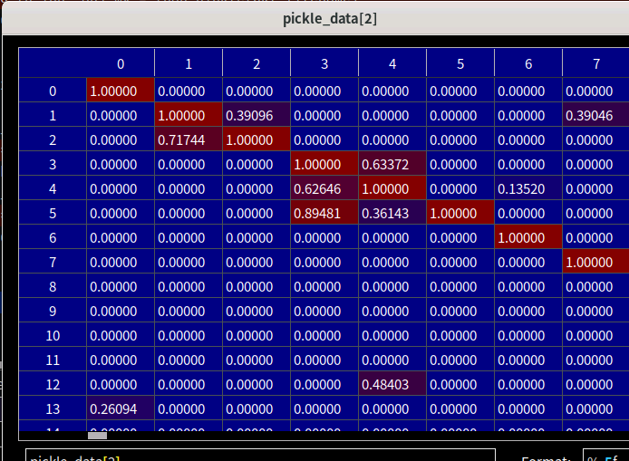
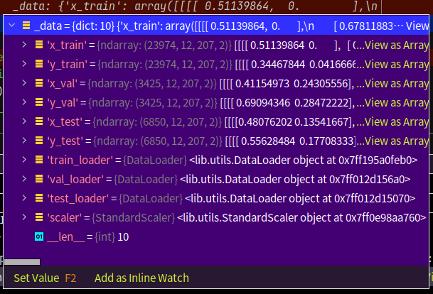
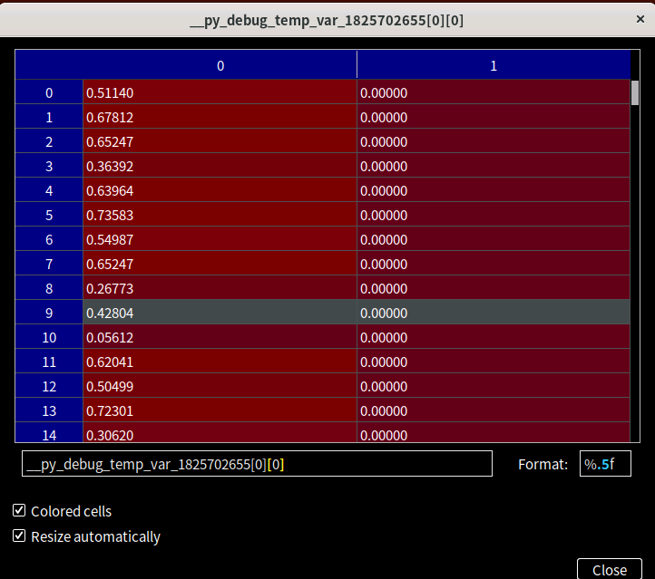
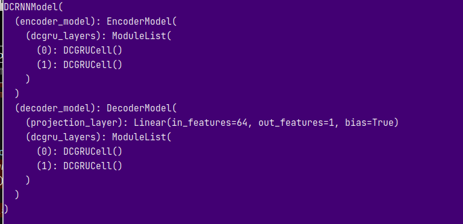
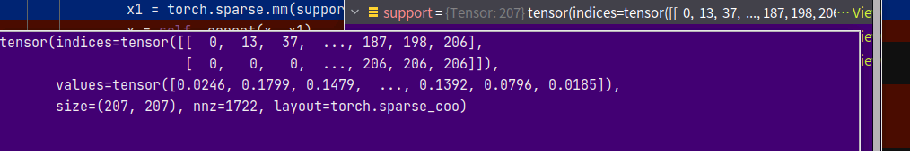
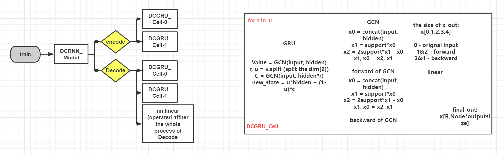

This doc shows the detail of DCRNN.

Data has been processed and you can find the detail of the porecessed data in [Prepare_Data](https://github.com/tami1082/Traffic-Public-Datasets/blob/main/Prepare_Data.md).

* **Read date:**  
The below pic shows the process of def load_graph_data. sensor_id, sensor_id_to_ind, adj_mx are represented by [0],[1],[2].  

  

   
  
  

  
The train/val/test dataset are shown in the below pic.  

    
   

  

* **Whole model:**  

    

  

* **Encoder:**  

Input X(time_seq,bacth_size, num_of_nodes, input_dim), e.g. (12,64,207,2)  
For each t into encoder_mode:  
x_t(64,207,2), hidden_state(num_of_layers, batch_size, hidden_state_size(nodes✖️rnn_units,207✖️64)), e.g. (2,64,13248) and in each layer, the hidden_state's dim is (64,13248).

Then, go into dcrnn_cell.py  
output_size = 2 * num_units = 128. In order to compute **value**, use -gconv, instead of multiplying in GRU.  
In gconv cell: the input's dim[2] (64,207,2) and the hidden_state's dim[2] (64,207,64) are concatenated, the final input's dim is (64,207,66(64+2)). The diffusion steps need two adj_mx matrixs to complete the dcrnn and the two matrixs are stored in **supports**(shown in the below pic). There are some steps of reshaping matrixs, these can adjust the input's/ output's dim.  

    

  

* **Decoder:**  
The part is similar with the encoder part. The below pic shows the inner part of the model. And in this repository, you have access to the [Image/dgcnn](https://github.com/tami1082/Traffic-Public-Datasets/tree/main/Images/gdcnn) to find other details of the model.  

    

  
